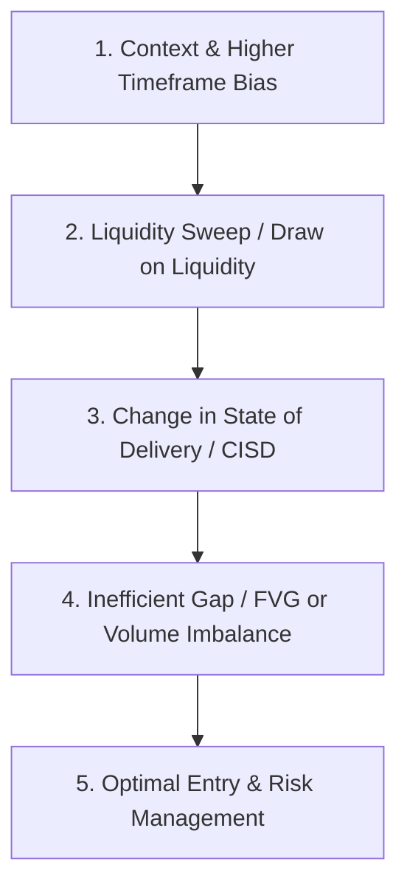

A complete field guide to the ICT / Smart-Money-Concepts NQ futures scalping system taught by Robert "Powell" Powell and his **Dumb Money Concepts** community—built from his own spoken explanations across 8 teaching sessions, matched frame-by-frame to chart evidence[cite: 1].

> **Source Verification Notice:** This guide was compiled from verified timestamped video transcripts and on-screen execution frames[cite: 1]. Spoken rules, numeric risk parameters, and execution discretion explained on camera are documented directly without inference[cite: 1].

---

## Method & Sources

This guide is structured from official timestamp-aligned subtitle files (`.srt`) and high-resolution chart frames[cite: 1]:

* **Verified Transcripts:** Numeric parameters, trade mechanics, and discretionary filters spoken verbally across all 8 sessions have been extracted directly[cite: 1].
* **Visual Frame Analysis:** Indicator settings, Fibonacci levels, long/short risk-reward tool readouts, and execution panels (Tradovate) were cross-matched with spoken timestamps[cite: 1].
* **Public Cross-Reference:** Verified against his public community channels (including `#powell-levels` in *Dumb Money Concepts*) and public open-source indicator documentation (e.g., Wick Theory)[cite: 1].

---

## Foundations & Toolkit

The setup utilizes a standardized, low-clutter charting layout on **TradingView** connected to **Tradovate** for execution[cite: 1].

| Layer | Component | Implementation Notes |
| :--- | :--- | :--- |
| **Platform** | TradingView (Pro/Premium)[cite: 1] | Uses Bar Replay for backtesting; side-by-side multi-chart views (NQ & ES)[cite: 1]. |
| **Execution** | Tradovate[cite: 1] | Integrated directly via TradingView's `Trading Panel`[cite: 1]. |
| **Instrument** | NQ (E-mini Nasdaq-100)[cite: 1] | Primary instrument[cite: 1]. ES is monitored simultaneously for SMT divergence[cite: 1]. |
| **Prop Accounts** | Apex, Topstep, Alpha Futures, Tradeify[cite: 1] | Standard funded account rules and drawdowns apply[cite: 1]. |
| **Theme** | Custom ("James default")[cite: 1] | Slate-gray background, dark orange/red bear candles, black/charcoal bull candles[cite: 1]. |

### Confirmed Indicators & Overlay Settings

1. **ICT Killzones [LuxAlgo]:** Highlights session times[cite: 1]. Configured with Fibonacci levels ($0, 0.236, 0.382, 0.5, 0.618, 0.782, 1$) driving structural zone calculations[cite: 1].
2. **ICT NWOG/NDOG & EHPDA [LuxAlgo]:** Plots New Week Opening Gaps (NWOG) and New Day Opening Gaps (NDOG)[cite: 1]. Lookback settings dynamically adjusted ($5 \to 44$) for macro context[cite: 1].
3. **Key Opens (Custom):** Horizontal rays plotting three critical daily session opens (Eastern Time)[cite: 1]:
   * **18:00 (6:00 PM ET)** — Globex Open[cite: 1]
   * **00:00 (12:00 AM ET)** — Midnight Open[cite: 1]
   * **10:00 (10:00 AM ET)** — Post-Equities Open / Macro Window[cite: 1]
4. **TradingView Risk/Reward Tool:** Placed on-chart prior to order placement to fix stop distance, target projection, and R-multiple[cite: 1].

---

## The Core 5-Step Execution Checklist

Every trade executed under the Powell Model must satisfy these five sequential conditions[cite: 1]:



### Step-by-Step Breakdown

1. **Higher Timeframe Context & Bias ($15\text{m} / 1\text{h}$)**[cite: 1]
   * Identify key liquidity pools: Previous Day High/Low (PDH/PDL), Session High/Low, or unadjusted Opening Gaps (NWOG/NDOG)[cite: 1].
2. **Liquidity Sweep (The Hook)**[cite: 1]
   * Price must sweep an established high/low to trigger stop orders or engineer liquidity into an institutional POI (Point of Interest)[cite: 1].
3. **Change in State of Delivery (CISD)**[cite: 1]
   * Immediate aggressive displacement breaking the opposing candle's open/close structure, confirming institutional order flow reversal[cite: 1].
4. **Imbalance Creation (Fair Value Gap / Volume Imbalance)**[cite: 1]
   * The displacement leg must leave a three-candle Fair Value Gap (FVG) or an explicit Volume Imbalance[cite: 1].
5. **Entry at OTE / CE with Controlled Risk**[cite: 1]
   * Limit entry set at the **Consequent Encroachment (CE — 50% level)** of the FVG, or within the $0.618 - 0.786$ Optimal Trade Entry (OTE) Fib zone[cite: 1].
   * Invalidated if price breaks beyond the swing extreme[cite: 1].

---

## Key Framework Components

### 1. Engineered Liquidity & AMD
Market delivery follows the **Accumulation, Manipulation, Distribution (AMD)** cycle[cite: 1]:
* **Accumulation (Asian/London):** Range-bound price action engineering buy-side liquidity (BSL) above and sell-side liquidity (SSL) below[cite: 1].
* **Manipulation (Judas Swing / NY Open):** Aggressive expansion sweeping engineered liquidity to fill institutional orders[cite: 1].
* **Distribution:** Trend expansion toward the primary higher timeframe target[cite: 1].

### 2. Market Maker Expansion Models (MMXM)
* **MMBM (Market Maker Buy Model):** Original Sell-Side Curve $\to$ Consolidation at High Timeframe Level $\to$ CISD $\to$ Buy-Side Expansion Curve[cite: 1].
* **MMSM (Market Maker Sell Model):** Original Buy-Side Curve $\to$ Sweep of Liquidity $\to$ CISD $\to$ Sell-Side Expansion Curve[cite: 1].

### 3. Change in State of Delivery (CISD)
Unlike a standard Market Structure Shift (MSS) which may require breaking a major swing point, a **CISD** occurs when a candle closes beyond the *opening price of the series of up/down candles* that created the sweep[cite: 1]. This provides earlier confirmation with tighter risk control[cite: 1].

### 4. Fibonacci, OTE, and Consequent Encroachment
When measuring a displacement leg from low to high (or high to low)[cite: 1]:

* **Optimal Trade Entry (OTE):** $0.618$, $0.705$, and $0.786$ retracement levels[cite: 1].
* **Consequent Encroachment (CE):** Exact $50\%$ ($0.500$) midpoint of an FVG or wick body[cite: 1]. Entries placed at CE reduce drawdown and increase the R-multiple[cite: 1].

### 5. Wick Theory
Wicks represent rejection and hidden lower-timeframe gaps[cite: 1]:
* A long wick body is treated as an imbalance zone[cite: 1].
* The $50\%$ mark of the wick (Wick CE) acts as a high-probability support/resistance pivot for limit entries[cite: 1].

---

## Top-Down Execution & Risk Rules

```
HTF Bias (15m / 1h) ──> LTF Structure (1m / 3m) ──> CISD + FVG ──> Limit Order at CE/OTE
```

### Risk Parameters & Position Sizing

```math
\text{Contract Size} = \frac{\text{Account Equity} \times \text{Risk \%}}{\text{Stop Loss Distance (pts)} \times \text{Point Value}}
```

* **Target Risk-Reward:** Minimum $1:2\text{ R}$, targeting $1:3\text{ R}$ to $1:5\text{ R}$ on expansion setups[cite: 1].
* **Stop Placement:** Placed strictly behind the swing high/low that executed the liquidity sweep, or just outside the boundaries of the CISD anchor candle[cite: 1].
* **Trade Management:** Partial profits scaling at $1:1.5\text{ R}$ or key liquidity levels; stops moved to breakeven once price reaches the initial target structure[cite: 1].

---

## Execution Playbook (Step-by-Step)

```
[Phase 1: Pre-Market Analysis]
  ├── Mark 18:00, 00:00, 10:00 Open Lines
  ├── Draw PDH, PDL, Asia High/Low, London High/Low
  └── Identify active NWOG / NDOG zones

[Phase 2: Execution Window (NY Session)]
  ├── Wait for Sweep of Primary Liquidity Target
  ├── Observe LTF Response (1m / 3m Chart)
  ├── Confirm CISD (Candle close past series open)
  └── Identify Imbalance (FVG or Volume Imbalance)

[Phase 3: Order Execution & Management]
  ├── Place Limit Order at FVG Consequent Encroachment (50%)
  ├── Set Hard Stop behind Sweep High/Low
  ├── Target Opposite Liquidity Pool (Min 1:2 R)
  └── Scale Partials at Key Structural Intersections
```

---

## Psychology, Discretion & Best Practices

1. **Respect Key Opens:** Price relative to the **00:00 (Midnight)** and **08:30 / 10:00 AM** opens dictates intraday premium/discount bias[cite: 1].
2. **Avoid Chasing Expansion:** Never enter market orders at the tip of expansion candles; wait for the retracement into FVG/CE[cite: 1].
3. **No Setup, No Trade:** If displacement lacks an FVG or fails to produce a clear CISD, the trade is void regardless of directional bias[cite: 1].
4. **SMT Divergence Filter:** Confirm high-probability setups by checking correlation between NQ and ES[cite: 1]. If NQ sweeps a high but ES fails to make a higher high, SMT divergence confirms smart money distribution[cite: 1].

---

## Disclaimer

> **Financial Disclaimer:** This document is for educational purposes only and does not constitute financial advice[cite: 1]. Futures trading involves substantial risk of loss and is not suitable for every investor[cite: 1]. Past performance or trade setups discussed do not guarantee future returns[cite: 1].
